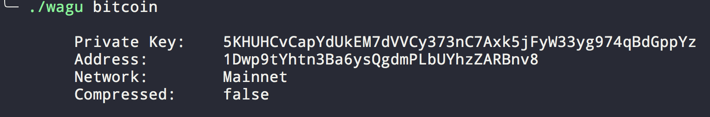
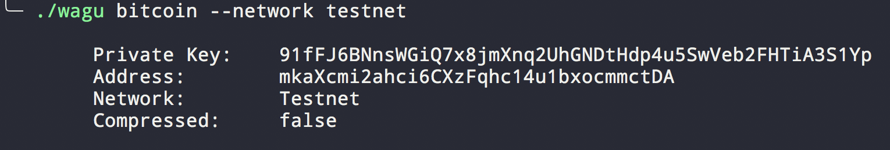
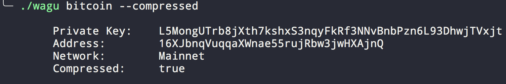
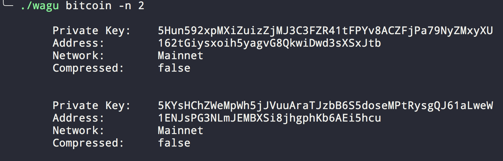

# wagu
Pronounced like [wagyu](https://en.wikipedia.org/wiki/Wagyu). Wagu is the **wa**llet **g**eneration **u**tility.

Wagu allows users to generate wallets for the following cryptocurrencies:

- Bitcoin

<!--toc-->

## Features

#### Generate a wallet with default options



#### Generate testnet and mainnet wallets



#### Generate compressed and uncompressed (default) wallets 



#### Generate multiple wallets of the same kind




## Help

The cli contains useful help text, displayed below.

```
wagu v0.1.0
Argus Observer <ali@argus.observer>
Generate a wallet for any cryptocurrency

Supported Currencies: Bitcoin

USAGE:
    cli [FLAGS] [OPTIONS] <currency>

FLAGS:
    -c, --compressed    Enabling this flag generates a wallet which corresponds to a compressed public key
    -h, --help          Prints help information
    -V, --version       Prints version information

OPTIONS:
    -n, --count <count>        Number of wallets to generate
    -N, --network <network>    Network of wallet(s) to generate (e.g. mainnet, testnet)

ARGS:
    <currency>    Name of the currency to generate a wallet for (e.g. bitcoin)
```