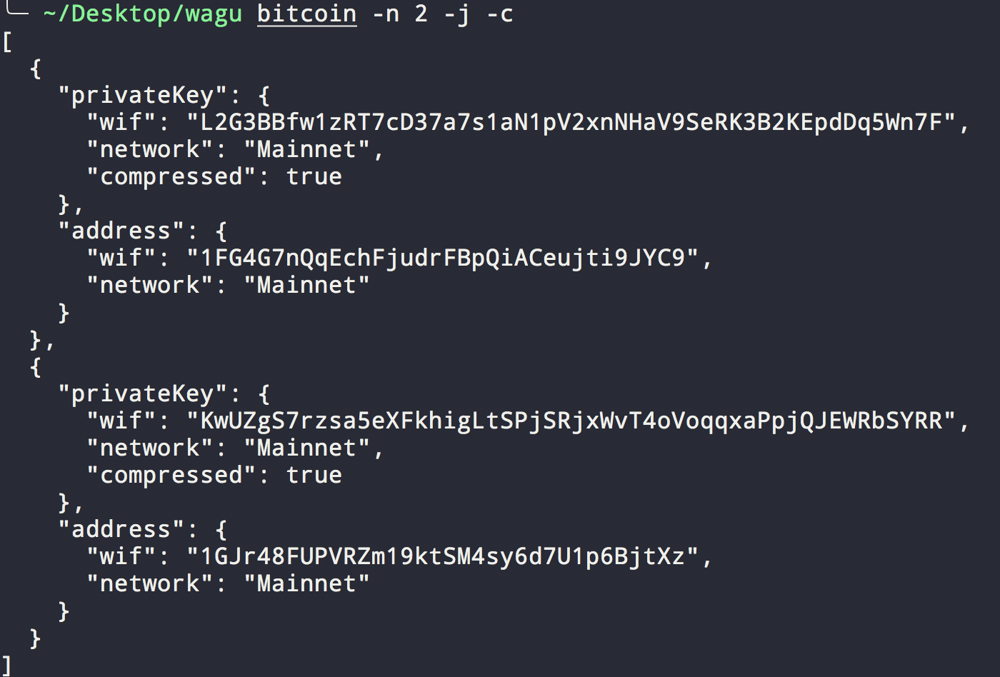

# wagu

Pronounced like [wagyu](https://en.wikipedia.org/wiki/Wagyu). Wagu is the **wa**llet **g**eneration **u**tility.

Wagu allows users to generate wallets for the following cryptocurrencies:

- Bitcoin

##  1. <a name='TableofContents'></a>Table of Contents

<!-- vscode-markdown-toc -->
* 1. [Table of Contents](#TableofContents)
* 2. [Features](#Features)
		* 2.1. [Generate a wallet with default options](#Generateawalletwithdefaultoptions)
		* 2.2. [Generate wallets as JSON object](#GeneratewalletsasJSONobject)
		* 2.3. [Generate a P2WPKH (SegWit) Wallet](#GenerateaP2WPKHSegWitWallet)
		* 2.4. [Generate testnet and mainnet wallets](#Generatetestnetandmainnetwallets)
		* 2.5. [Generate compressed and uncompressed (default) wallets](#Generatecompressedanduncompresseddefaultwallets)
		* 2.6. [Generate multiple wallets of the same kind](#Generatemultiplewalletsofthesamekind)
* 3. [Help](#Help)

<!-- vscode-markdown-toc-config
	numbering=true
	autoSave=true
	/vscode-markdown-toc-config -->
<!-- /vscode-markdown-toc -->

##  2. <a name='Features'></a>Features

####  2.1. <a name='Generateawalletwithdefaultoptions'></a>Generate a wallet with default options


####  2.2. <a name='GeneratewalletsasJSONobject'></a>Generate wallets as JSON object



####  2.3. <a name='GenerateaP2WPKHSegWitWallet'></a>Generate a P2WPKH (SegWit) Wallet


####  2.4. <a name='Generatetestnetandmainnetwallets'></a>Generate testnet and mainnet wallets


####  2.5. <a name='Generatecompressedanduncompresseddefaultwallets'></a>Generate compressed and uncompressed (default) wallets 


####  2.6. <a name='Generatemultiplewalletsofthesamekind'></a>Generate multiple wallets of the same kind


##  3. <a name='Help'></a>Help

The cli contains useful help text, displayed below.

```
wagu v0.2.0
Argus Observer <ali@argus.observer>
Generate a wallet for any cryptocurrency

Supported Currencies: Bitcoin

USAGE:
    wagu [FLAGS] [OPTIONS] <currency>

FLAGS:
    -c, --compressed    Enabling this flag generates a wallet which corresponds to a compressed public key
    -h, --help          Prints help information
    -j, --json          Enabling this flag prints the wallet in JSON format
    -V, --version       Prints version information

OPTIONS:
    -n, --count <count>        Number of wallets to generate
    -N, --network <network>    Network of wallet(s) to generate (e.g. mainnet, testnet)

ARGS:
    <currency>    Name of the currency to generate a wallet for (e.g. bitcoin)
```